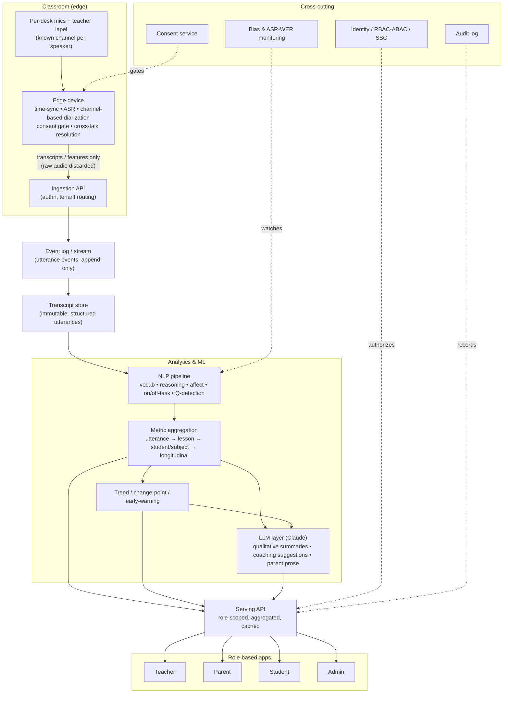

# AI Classroom — Value, Dashboards & Architecture

A design exploration: *if* this ran in a real classroom with diarized transcripts
accumulating over weeks and months — **transcripts only, no acoustic/prosodic
notes** — what value could we return to each stakeholder, and how would we build
it responsibly?

> This is a thinking document, not a spec. It deliberately leads with the
> measurement-integrity and ethics problems, because in this domain (audio of
> minors in a classroom) those constraints *are* the architecture.

---

## 1. What signal actually lives in text-only diarized transcripts

Our prototype transcripts carry `(quietly)`, `(off-task)`, `(overlapping)` notes.
**In reality we won't have those.** All we truly get per utterance is:

```
{ student_id | teacher_id, lesson_id, start_ts, end_ts, text }
```

Everything else is *derived*. That's a feature, not a bug — but it bounds what we
can honestly claim.

### What we CAN derive

**Structural / participation (from IDs + timestamps):**
- Talk volume: words and speaking-seconds per student, per lesson.
- Turns: number of speaking events; turn-length distribution.
- Share of floor: a student's % of *student* talk (teacher talk excluded).
- Response latency: gap between a teacher question and a student answer.
- Initiation vs. response: did the student volunteer, or were they named first
  by the teacher in the prior turn? (Inferable from the transcript.)
- Overlap / interruption: co-timed utterances across channels.
- Peer-to-peer interaction: in group segments, who responds to whom → a social
  interaction graph.

**Content / linguistic (NLP over the text):**
- Academic vocabulary use: correct use of target terms (`denominator`,
  `condensation`, `theme`, `geography`) — the single best proxy for learning.
- Reasoning markers: `because`, `so`, `if…then`, `I think… because` — justification
  and causal thinking, not just answers.
- Question-asking: student-*generated* questions = curiosity/metacognition.
- Evidence use: quoting, "the text says," "our data showed."
- Elaboration: answer length × syntactic/idea complexity.
- Affect (lexical only): frustration ("I can't", "I don't get it", "I'm bad at
  this"), confidence, enthusiasm.
- On-task vs. off-task classification.
- Collaboration language in group work: "what do you think?", "good idea", building
  on a peer's turn (mindset & social-emotional signal).
- Fixed vs. growth-mindset language.

**Longitudinal (the actual product — only visible over weeks/months):**
- Vocabulary-acquisition curves per student per subject.
- Engagement *variance* by subject, by lesson format, by time of day.
- Recovery patterns: does a student re-engage after a support move?
- Trajectory / change-point detection: a sustained decline = an early-warning flag.
- Peer-network evolution: who a student works well with over a term.

### What we CANNOT honestly claim (and must not fake)
- **Silence ≠ disengagement.** Text-only loses the "attentive but quiet" signal
  entirely. A low talk-count student may be our most engaged (see persona **C**).
- Tone, sarcasm, warmth, stress — mostly gone without prosody.
- Comprehension is *inferred*, never measured. This complements assessment; it
  does not replace it.

---

## 2. The measurement-integrity problem (read this before any dashboard)

Two biases will actively harm the students the system is meant to help, unless we
design against them:

1. **Talk-time bias.** Naïve "engagement = words spoken" rewards the loud (A, E)
   and punishes the quiet-but-engaged (C) and the still-building multilingual
   learner (G). **Mitigation:** never surface raw talk-time as "engagement." Weight
   *quality-when-participating* and *response-when-invited*, and always pair a
   participation number with a content-quality number. Treat a low-talk / high-
   quality profile as a *pattern to support*, not a deficit to flag.

2. **ASR / diarization bias.** Speech-to-text has higher error rates for
   children, non-standard dialects, and multilingual speakers — i.e. it is least
   accurate for **G** and most accurate for **A**. Uncorrected, the pipeline
   *manufactures* an engagement gap that mirrors existing inequities.
   **Mitigation:** monitor word-error-rate by subgroup as a first-class SLO;
   confidence-gate low-quality transcripts out of analytics; never let ASR
   confidence silently become an engagement score.

Everything below assumes these guardrails are in place.

---

## 3. Value & dashboards by stakeholder

The same underlying metrics, filtered and *translated* per audience. Access is
strictly role-scoped (see §5).

### 3a. The Student (age 10–11) — strengths-based, private, motivating
Tone is everything here: growth over grades, self vs. self (never ranked against
peers), and framed as goals they own.
- "Your science words are growing 🌱" — a simple count of academic terms they used
  correctly this week vs. last.
- "You asked **4 questions** in science this week" — curiosity as a celebrated skill.
- A personal goal they set ("share one idea in math this week") with gentle progress.
- Badges for *behaviors*, not outcomes: asking a question, building on a friend's
  idea, using evidence.
- **Never** show: rank, talk-time vs. classmates, negative affect flags.

### 3b. The Parent — plain-language, trend-based, actionable
- A weekly digest, not a live feed (avoids the surveillance feel):
  "This week your child was most engaged in **discussion-based lessons** and
  quieter in **math**." Trends, not single days.
- Subject-specific strengths & growth areas in prose, contextualized — *never*
  raw metrics like "spoke 214 words."
- **Concrete home supports**: "They loved the states-of-matter lab — ask them to
  show you condensation on a cold glass." Turns data into a conversation.
- Longitudinal reassurance: "steadily using more science vocabulary since February."
- Clear controls: what's collected, retention, and an opt-out. Consent-forward.

### 3c. The Teacher — the richest, most operational view
This is where the product earns its keep. Two lenses:

**(i) Know each student:**
- Per-student engagement profile *by subject and format* (F: strong in Social
  Studies discussion, disengaged in Math — the same child).
- "Students you may be under-reaching": an **equity-of-voice** panel showing who
  hasn't spoken/been invited in N days (surfaces C, G before they slip through).
- Early-warning flags with the *evidence* attached (the utterances), so the teacher
  judges — the system suggests, never decides.
- Suggested individualization moves tied to the pattern ("F shuts down after an
  error in math — try naming the mistake type, not the child").

**(ii) Coach my own practice (teacher-owned, private by default):**
- Teacher-vs-student talk ratio per lesson.
- Question mix: open vs. closed; wait-time after questions.
- **Distribution of who you call on** (the Teacher 1 pattern: hands = A & E).
- Feedback/praise patterns.
- Trend of these over the term, with one concrete "try this next" nudge.
- *Critical:* this view belongs to the teacher, not to admin evaluation (see §5).

### 3d. School Admin — aggregate, governed, never individual surveillance
- Cohort/grade-level engagement and vocabulary trends (anonymized/aggregated).
- **Program efficacy**: did a new curriculum or PD move the needle?
- **Professional-development needs**: coaching *themes* across teachers (e.g.
  "wait-time is a school-wide growth area") — aggregated, not a teacher leaderboard.
- Equity monitoring across subgroups — with governance, because this is the most
  abusable view (see §5).
- Explicitly **out of scope**: ranking individual teachers, individual student
  discipline. Guardrail these at the data layer, not just policy.

---

## 4. What we can show *over time* (the longitudinal core)

Single lessons are noise; the value is trajectory.
- **Engagement time-series** per student, faceted by subject/format/time-of-day —
  makes F's subject-specific dip and D/H's format-dependence *visible*, where a
  daily average would hide both.
- **Vocabulary growth curves** — the closest honest proxy to learning.
- **Change-point / early-warning**: a sustained 3–4 week decline in participation
  *and* affect raises a human-reviewed flag.
- **Recovery tracking**: after a teacher support move, did engagement rebound?
  (Closes the loop between coaching suggestion and effect.)
- **Peer-interaction graph** evolution across a term.
- **Teacher-practice trends**: is the call-on distribution getting more equitable?

---

## 5. Ethics, privacy & governance (non-negotiable, and it drives the design)

Recording minors continuously is high-risk. These are architectural requirements,
not a footer.

- **Consent & assent**: parental consent + age-appropriate student assent, tracked
  in a consent service whose state *propagates to ingestion* — a non-consented
  student's audio is never captured/attributed.
- **Legal**: FERPA, COPPA, state student-privacy laws (e.g. CA SOPIPA), GDPR where
  relevant. Purpose limitation baked in: **not** for high-stakes teacher evaluation
  or student discipline.
- **Data minimization**: prefer to **discard raw audio at the edge** and retain
  only transcripts (or only derived features). Short, explicit retention windows;
  right-to-deletion.
- **Anti-surveillance framing**: growth, not judgment. A chilling effect on kids
  and teachers is a *product failure*, not a side effect.
- **Human-in-the-loop**: insights are conversation-starters; no automated
  consequential decisions.
- **Transparency & contestability**: teachers and (age-appropriately) students can
  see and challenge their own data.
- **Bias monitoring**: ASR WER-by-subgroup as a tracked SLO (see §2).
- **Audit logging**: every access to student data is logged — accountability is a
  feature.
- **Access boundaries as data-layer guarantees**, not just UI: parent → own child;
  teacher → own class; student → self; admin → aggregates only. Teacher self-
  coaching data is walled off from admin evaluation views by default.

---

## 6. Architecture

Privacy-by-design pushes as much as possible to the **edge**, so raw audio ideally
never leaves the classroom.



### Layer notes

**Capture / edge.** Each desk mic is a *known channel*, which makes diarization
largely a hardware problem — a huge simplification over single-room-mic diarization.
The hard parts are (a) **time sync** across mics (NTP/PTP) for accurate timestamps
and overlap detection, (b) **cross-talk / bleed** (a loud neighbor on your mic) —
resolved via per-channel energy + overlap logic, and (c) the **consent gate**
excluding non-consented speakers at source. Running ASR + diarization on an
edge device (Jetson-class box or classroom mini-PC, Whisper-class model) lets raw
audio be discarded locally — the strongest privacy posture.

**Transport & storage.** Utterances flow as events onto an append-only stream
(Kafka/Kinesis) into an **immutable transcript store** — this is the canonical
record and is structurally identical to our prototype `.md` transcripts. Structured
rows in a warehouse/Postgres; object storage (Parquet) for scale.

**Analytics & ML.** Two tiers by cost/volume:
- *High-volume, cheap classifiers* for per-utterance tagging (academic-vocab,
  on/off-task, question detection, reasoning markers).
- *LLM (Claude) for the hard, low-volume work*: judging reasoning quality,
  generating teacher coaching suggestions, and writing the plain-language parent
  summaries. Metrics roll up utterance → lesson → student/subject → longitudinal in
  a feature store; trend/change-point jobs feed the early-warning flags.

**Serving & apps.** A role-scoped API over the analytics store (row/column-level
security), aggressively cached, feeding four thin clients (React / React Native).
Reports (weekly parent digest) are generated jobs, not live queries.

**Cross-cutting.** Consent service (gates ingestion), identity + RBAC/ABAC over
school SSO (Google/Clever/ClassLink, OIDC/SAML), audit logging on every data
access, encryption in transit/at rest, tenancy isolation (district → school →
class → student), retention/deletion enforcement, and bias/WER monitoring as an SLO.

### Multi-tenancy & access
Access rules are enforced at the **data layer**, not just the UI: parent→own child,
teacher→own class, student→self, admin→aggregates only, and teacher self-coaching
data is isolated from admin evaluation views. Tenant isolation per district; consider
data-residency requirements.

---

## 7. Suggested phasing (de-risk the hard/sensitive parts first)

1. **MVP — Teacher-only, single class, retro reports.** Ingest transcripts (start
   from files like this repo's), compute participation + vocab + equity-of-voice,
   show one teacher a weekly view. No parents/students yet. Validate that insights
   are *true and useful* before widening the audience.
2. **Add longitudinal + early-warning.** Needs weeks of data; tune against real
   outcomes to avoid false alarms.
3. **Add parent digest + student view.** Only after the metrics are trustworthy and
   consent/governance is real — these audiences are the highest-trust, lowest-
   tolerance-for-error.
4. **Add admin aggregates + teacher self-coaching**, with governance guarantees.
5. **Harden**: edge/on-device ASR, bias SLOs, audit, deletion, third-party privacy
   review.

**Guiding principle:** the transcript is easy; *trust* is the product. Measurement
integrity (§2) and governance (§5) are the moat, not the ML.
